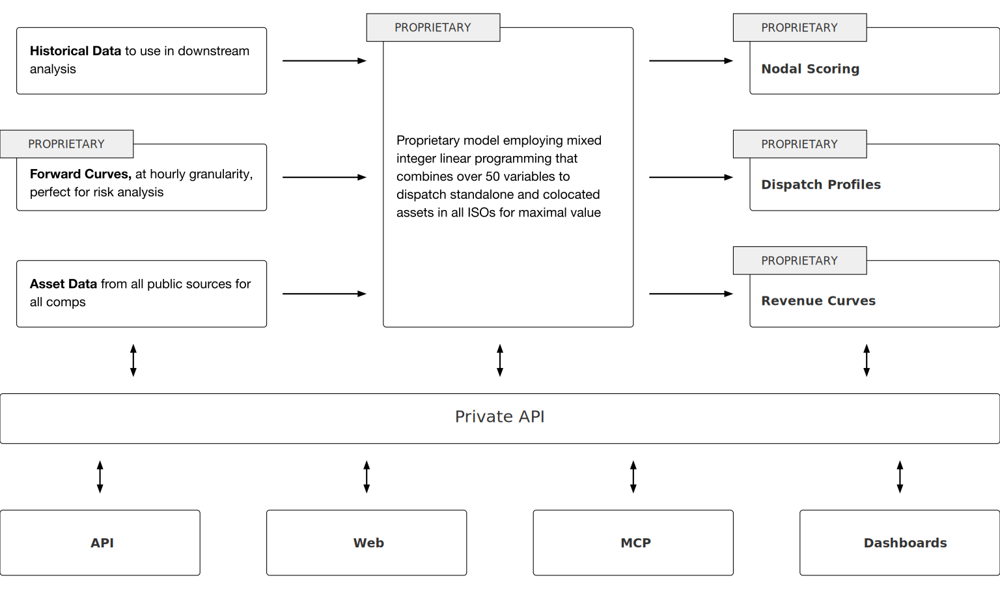

# BatteryOS: Instant & Actionable BESS Market Intelligence

## The Analysis Trap

You're stuck paying $25,000+ per site just to analyze whether a battery project makes sense. By the time you get results 3-6 months later, market conditions have shifted and your "optimal" strategy is already obsolete. You can only afford to study 3-5 locations, forcing you to guess which sites might be worth the expensive analysis - and hope you guessed right.

Meanwhile, interconnection queues fill within months. Grid conditions evolve continuously. Revenue opportunities shift as ISOs launch new products and competing generation comes online. Every day spent in analysis paralysis is a day competitors secure better sites and capture first-mover advantages.

Traditional feasibility analysis creates a vicious cycle: expensive per-site costs limit your search space, slow delivery makes results obsolete, and narrow evaluation means you might miss the truly optimal opportunities entirely. You're forced to make major investment decisions based on limited, outdated information while markets move faster than your analysis can keep pace.

## Comprehensive Search + Instant Analysis

BatteryOS enables you to evaluate 500+ potential battery sites for the same cost that traditional consultants charge to analyze 3 locations. Instead of hoping your pre-selected sites are optimal, you can identify the truly best opportunities through exhaustive search across all possibilities.

Our platform provides instant comprehensive analysis of any battery configuration at any location across all major ISOs. You get complete project economics, revenue optimization across all income streams, risk assessment, and performance benchmarking - delivered in seconds, not months.

**Core Capabilities:**
- **Exhaustive Site Evaluation**: Model every viable location simultaneously rather than analyzing a few pre-selected options
- **Revenue-Agnostic Optimization**: Simultaneously optimize across energy arbitrage, frequency regulation, capacity payments, demand response, and grid services without hierarchical assumptions
- **Real-Time Market Intelligence**: Continuous data feeds with 5-minute pricing granularity, interconnection tracking, and regulatory updates
- **Instant Scenario Testing**: Stress-test hundreds of market conditions, configurations, and strategies in real-time
- **Complete Integration**: API access, web interface, natural language queries, and dashboard monitoring

## Transform Decision-Making Economics

**Break Free from the Pre-Selection Trap**: Traditional economics force you to guess which sites deserve expensive analysis. Platform pricing lets you evaluate the entire opportunity space, discovering optimal locations you never would have considered.

**Maintain Strategy Relevance**: While competitors deliver perfect analysis of obsolete conditions, you can adapt strategies continuously as markets evolve. When regulation prices spike or transmission upgrades alter power flows, you adjust immediately rather than waiting for the next planning cycle.

**Capture Timing Advantages**: Good nodes today become average nodes by the time projects are built. The analysis that matters isn't finding the "perfect" site but maintaining decision velocity that enables continuous adaptation to changing fundamentals.

**Enable Comprehensive Intelligence**: Instead of selective sampling across a few options, you gain complete market awareness. You're not just making faster decisions - you're making fundamentally better decisions because you're working with complete information.

**Economic Model Transformation**: Traditional per-node pricing creates perverse incentives to limit search scope. Our platform economics invert this - comprehensive evaluation becomes the economically rational approach.

## Depth + Breadth + Velocity Architecture

### Advanced Analytical Engine

Our proprietary mixed integer linear programming algorithm combines over 50 variables to optimize dispatch strategies for standalone and co-located assets across all ISOs simultaneously. Unlike traditional models that assume revenue hierarchies, our revenue-agnostic optimization evaluates all income streams without predetermined assumptions.

Full project economics modeling incorporates equipment costs, interconnection fees, permitting timelines, operations and maintenance, insurance, taxes, degradation curves, and revenue projections across multiple market scenarios and sensitivity analyses.

### Comprehensive Data Foundation

Real-time and historical pricing across all major ISOs with 5-minute granularity, interconnection queue status, transmission planning updates, and regulatory change tracking. Operational performance data from thousands of existing BESS installations provides ground truth for model validation rather than relying solely on theoretical projections.

Proprietary forward-looking price forecasts incorporate fundamental grid evolution - transmission upgrades, generation interconnections, load center shifts - rather than statistical extrapolation from historical patterns that assume the future resembles the past.

### API-First System Architecture

BatteryOS uses APIs internally for all inter-component communication while presenting simplified interfaces to customers. This architecture enables independent scaling of data ingestion, calculation engines, and output generation services while maintaining system-wide consistency.

The Private API layer serves as the unified interface between core processing capabilities and all user applications, ensuring data consistency across interfaces while implementing progressive access controls at the API level.

**Core Processing Flow:**
- Historical Data → Proprietary Algorithm → Nodal Scoring
- Forward Curves → Mixed Integer Linear Programming → Dispatch Profiles  
- Asset Data → 50+ Variable Optimization → Revenue Curves

**Four Access Methods:**
- **API Integration**: Direct connection to existing Excel models, Python workflows, and proprietary systems
- **Web Interface**: Comprehensive modeling environment for complex analysis and reporting
- **MCP Interface**: Natural language analysis for quick questions and strategy validation
- **Dashboard Suite**: Real-time monitoring of market conditions and competitive intelligence

### Progressive Intelligence Access

**Market Exploration Level**: High-level opportunity identification and directional intelligence for strategic planning across regions and technologies.

**Project Development Level**: Detailed site-specific economics, revenue projections, risk analysis, and performance benchmarking for specific development opportunities.

**Portfolio Management Level**: Comprehensive competitive intelligence, market analysis, and performance optimization across multiple assets and market exposures.

### Integration Without Disruption

API connections enable direct integration with existing workflows. Analysis results flow seamlessly into established Excel models, Python scripts, and proprietary financial systems without disrupting proven decision-making processes. Complex calculations run once and serve multiple interface requests rather than duplicating computational work.

## Agility Over Perfection

> "A good plan violently executed now is better than a perfect plan executed next week" – George Patton

BatteryOS eliminates the analysis trap by transforming the economics and timeline of battery storage evaluation. Instead of expensive, slow, narrow analysis that becomes obsolete during delivery, you get comprehensive, instant, continuously updated intelligence that adapts faster than markets can evolve.

| Problem | Solution |
| :------ | :------- |
| Limited budget forces selective evaluation of pre-chosen sites | Platform pricing enables exhaustive search across all viable locations |
| Slow analysis delivers obsolete conclusions | Instant comprehensive analysis with real-time updates as conditions change |
| Static strategies become suboptimal as markets evolve | Revenue-agnostic optimization that adapts dynamically to changing conditions |
| Fragmented analysis across multiple vendors creates consistency issues | Unified platform with integrated data, calculations, and applications |
| Deep analysis requires choosing between speed and comprehensiveness | Advanced architecture delivers both comprehensive analysis and instant results 

**The Result**: You maintain competitive advantage through analytical agility rather than pursuing analytical perfection that arrives too late. You discover optimal opportunities through comprehensive search rather than hoping your limited analysis budget identified the best options. You adapt strategies continuously rather than remaining committed to assumptions that markets have already invalidated.

In battery storage markets where first-mover advantages compound and opportunities close within months, BatteryOS provides the analytical capabilities that match market velocity. You're no longer constrained by traditional analysis limitations - you can identify the best opportunities, adapt strategies continuously, and capture timing advantages that determine success in rapidly evolving energy markets.
